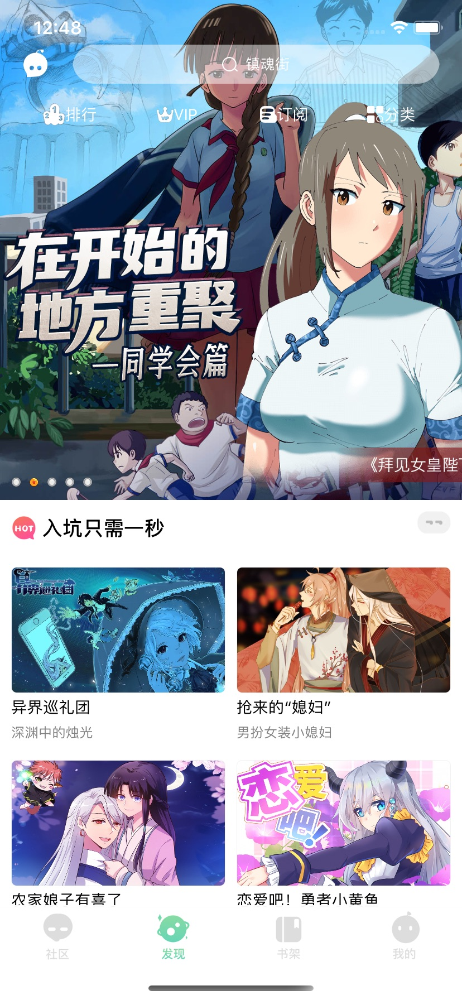
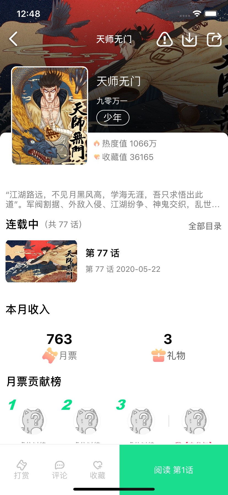
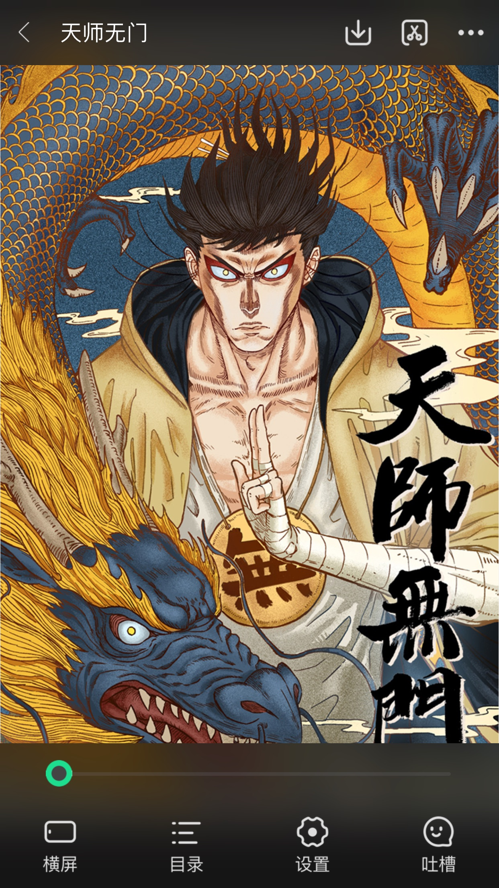
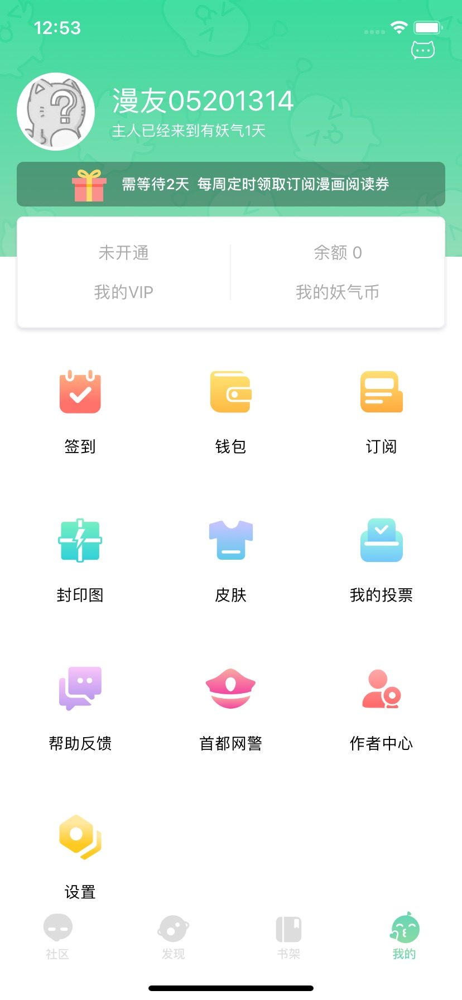

# U17

#### 介绍
**高仿有妖气漫画APP（最新V5.0版本）核心界面功能**

高仿有妖气漫画APP开发语言组件：Swift5(Moya+Alamofire、HandyJSON、Kingfisher、SnapKit、MJRefresh)

注：本项目基于旧版本重制界面、接口和功能。仅供Swift开发新手学习和借鉴，大神轻喷😁。

**Coding不易，给🌟Star⭐的JJ都增大10cm👍~**

#### 项目截图
###### 1. 首页

###### 2. 漫画详情

###### 3. 漫画阅读

###### 4. 个人中心

#### 特别鸣谢:

spicyShrimp [旧版仿有妖气漫画APP源代码](https://github.com/spicyShrimp/U17)
lb2281075105 [旧版仿有妖气漫画APP源代码](https://github.com/lb2281075105/LBU25-Swift)

#### 声明:

1. 仅开源供大家学习使用，禁止从事商业活动，如出现一切法律问题自行承担！！！
2. 仅学习使用,如有侵权,造成影响,请联系本人删除,谢谢。
